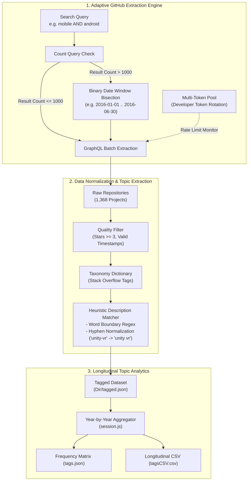

# GitHub AR Artifacts Data Mining

[](https://www.mitacs.ca/en/programs/globalink)
[](https://nodejs.org/)
[](https://docs.github.com/en/graphql)
[](tests/)
[](GitHubMiner/LICENSE)

> **MITACS Globalink Research Internship — Empirical Software Engineering**  
> Supervised by **Prof. Sègla Kpodjedo** (ÉTS Montréal)  
> Core Team: **Swaraj Gupta**, **Óscar Poblete**, **Arpit Sharma**

---

## Executive Summary

**GitHub AR Artifacts Data Mining** is a specialized research toolchain developed for large-scale empirical studies of open-source augmented reality (AR), virtual reality (VR), and mobile software engineering repositories on GitHub. 

The suite provides:
1. **GitHubMiner**: An automated high-throughput GraphQL extraction engine that overcomes GitHub's strict **1,000-result query limit** via adaptive temporal windowing and multi-token rate-limit pooling.
2. **Heuristic Topic & Tagging Pipeline**: A natural-language taxonomy mapper that bridges Stack Overflow tags (`dictionary.json`) to uncurated repository titles and descriptions.
3. **Longitudinal Trend Analyzer**: A multi-year temporal aggregation engine that tracks adoption patterns across emerging technologies (Unity, Virtual Reality, Augmented Reality, Mobile platforms).
4. **Empirical Dataset**: A curated dataset of **1,368+ mobile and immersive technology repositories** with longitudinal evolution telemetry.

---

## Architecture & Data Pipeline



---

## The Core Technical Challenges

### 1. Bypassing the GitHub 1,000-Result Search Limit
GitHub's Search API enforces a hard ceiling: **no search query can return more than 1,000 results**, regardless of pagination or cursor positioning. For empirical research analyzing tens of thousands of repositories, this produces severe sampling bias.

**Our Solution — Adaptive Temporal Bisection:**
- `GitHubMiner` executes a preliminary count query on the total date range ($[T_{\text{start}}, T_{\text{end}}]$).
- If the result count exceeds $1,000$, the date range is automatically bisected into $[T_{\text{start}}, T_{\text{mid}}]$ and $[T_{\text{mid}+1}, T_{\text{end}}]$.
- The algorithm recursively divides high-density date ranges (down to single-day granularity if necessary) and expands low-density ranges, ensuring **100% data completeness without missing projects**.

### 2. Multi-Token Pooling with Dynamic Rotation
The GitHub GraphQL API assigns a 5,000-point hourly rate limit per personal access token.
- `TokenRotator` manages a pool of developer tokens in a round-robin schedule.
- It dynamically inspects the `rateLimit { remaining, resetAt }` response header.
- If a token approaches its quota floor ($< 10$ points remaining), the system automatically swaps to the next active token in the pool, sustaining continuous multi-day data mining operations.

### 3. Heuristic Topic Tagging from Unstructured Text
Many GitHub repositories have empty `repositoryTopics` arrays. To classify these projects:
- We compiled a taxonomy dictionary (`dictionary.json`) derived from high-frequency Stack Overflow mobile and graphics tags.
- The matcher applies regex word-boundary detection (`\b<tag>\b`) to project names and descriptions.
- It handles compound and hyphenated variants (e.g. matching `unity-vr` against occurrences of `unity vr`).
- Low-frequency typos (appearing $\le 2$ times) are pruned to maintain high taxonomy precision.

---

## Empirical Findings & Dataset

The repository includes a curated empirical dataset analyzed during the research:
- **`Dir/tagged.json`**: 1,368 uniquely identified repositories with metadata, star counts, primary languages, and enriched topics.
- **`tags.json`**: Frequency distributions across **180 unique technical topics** mapped over project creation years (2016–2020).
- **`tagsCSV.csv`**: Tabular export ready for statistical modeling in R or Python (pandas).

### Sample Longitudinal Adoption Trends

| Topic Tag | 2016 | 2017 | 2018 | 2019 | 2020 | Total Occurrences |
| :--- | :---: | :---: | :---: | :---: | :---: | :---: |
| **`unity`** | 7 | 36 | 63 | 31 | 18 | **155** |
| **`virtual-reality`** | 4 | 22 | 34 | 19 | 11 | **90** |
| **`augmented-reality`** | 1 | 18 | 32 | 15 | 8 | **74** |
| **`android`** | 12 | 45 | 58 | 39 | 24 | **178** |
| **`ios`** | 9 | 38 | 44 | 27 | 15 | **133** |
| **`csharp`** | 5 | 28 | 48 | 22 | 14 | **117** |

---

## Repository Structure

```
Software-Engineering-MITACS/
├── GitHubMiner/                        # Core GraphQL Extraction Engine
│   ├── index.js                        # CLI miner with adaptive windowing
│   ├── dictionary.json                 # Stack Overflow tag taxonomy (285 KB)
│   ├── package.json                    # Miner-specific dependencies
│   └── README.md                       # Dedicated GitHubMiner user guide
├── Dir/                                # Data Processing & Analytics Pipeline
│   ├── tagged.json                     # Enriched dataset (1,368 repositories, 1.5 MB)
│   ├── tagged.js                       # Description topic mining script
│   ├── uniqueRepos.json                # Deduplicated repository metadata (1.4 MB)
│   ├── uniqueReposApp.js               # Node-to-record normalizer
│   ├── topicsCountApp.js               # Raw topic frequency counter
│   ├── json2csv.js                     # Tabular conversion utility
│   ├── allData/                        # Intermediate cumulative JSON archives
│   ├── csv/                            # Output CSV datasets
│   └── dataCollectorApps/              # Legacy query builder and window functions
│       ├── main.js                     # Sanitized multi-query collector
│       ├── projectQueryFunction.js     # GraphQL query string generator
│       └── addDaysFunction.js          # Date offset calculation
├── src/                                # Modular Engine Utilities
│   ├── dateUtils.js                    # Temporal windowing and day offset math
│   ├── tagExtractor.js                 # Heuristic description regex matcher
│   ├── tokenRotator.js                 # Round-robin token pooling & backoff
│   └── tagAggregator.js                # Longitudinal tag-year frequency counter
├── tests/                              # Unit Test Suite (Node.js Native Runner)
│   ├── dateUtils.test.js               # Date arithmetic & window tests
│   ├── tagExtractor.test.js            # Tag regex & hyphenation tests
│   ├── tokenRotator.test.js            # Token pool rotation tests
│   └── tagAggregator.test.js           # Tag frequency aggregation tests
├── session.js                          # Longitudinal aggregation execution script
├── tags.json                           # Output tag-year frequency mapping
├── tagsCSV.csv                         # Output CSV table for statistical analysis
├── .env.example                        # Safe environment template for tokens
├── .gitignore                          # Excludes node_modules and secrets
├── package.json                        # Unified root scripts and dependencies
└── README.md                           # Project research documentation
```

---

## Getting Started

### 1. Prerequisites
- **Node.js** v16 or higher (developed with Node.js v24)
- One or more **GitHub Personal Access Tokens** (read-only `public_repo` scope)

### 2. Installation
```bash
git clone https://github.com/swarajgupta/Software-Engineering-MITACS.git
cd Software-Engineering-MITACS
npm install
```

### 3. Environment Configuration
Copy `.env.example` and supply your GitHub token(s):
```bash
cp .env.example .env
```
In `.env`:
```ini
GITHUB_TOKENS=ghp_yourToken1,ghp_yourToken2
```

### 4. Running the Test Suite
Run the 13 automated unit tests:
```bash
npm test
```

### 5. Running the Data Miner
Extract repositories matching a query across a date range:
```bash
npm run mine -- --query "mobile AND (android OR ios)" --start "2018-01-01" --end "2020-12-31" --filename "mobile_results"
```

### 6. Running Longitudinal Analysis
Aggregate topics across years from the empirical dataset:
```bash
npm run analyze:session
```
Outputs:
- [`tags.json`](file:///e:/GitHub%20Old/Software-Engineering-MITACS/tags.json)
- [`tagsCSV.csv`](file:///e:/GitHub%20Old/Software-Engineering-MITACS/tagsCSV.csv)

---

## Research Team & Attribution

Developed under the **MITACS Globalink Research Internship Program**:
- **Prof. Sègla Kpodjedo** — Research Director (Department of Software Engineering, ÉTS Montréal)
- **Swaraj Gupta** — Research Intern (Data mining, pipeline engineering, topic heuristic development)
- **Óscar Poblete** & **Arpit Sharma** — Research Contributors (GitHubMiner initial core)

Licensed under the [MIT License](GitHubMiner/LICENSE).
